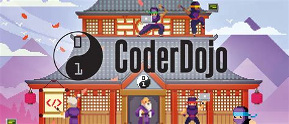

# CoderDojo Zottemgem: Lego League Challenge Code

---

> PyBricks libraries and source code for entry in the [Lego League robotics Competition](https://www.firstlegoleague.org/season).

Herbruikbare stukken code (libraries) voor het [Lego league team](https://www.firstlegoleague.org/season) van de [Zottegemse CoderDojo](https://zottegem.coderdojobelgium.be).

## Structuur van deze repository

Deze code repository (engels voor *'opslagplaats'*) bestaat uit twee grote delen:

- [`code`](./code/): Code geschreven door onze Ninjas en Coaches.
- [`docs`](./docs/): Gebruiksaanwijzingen en extra informatie ( dit wordt ook *'documentatie'* genoemd)

De bestanden in onze documentatie worden gebruikt om automatisch een website te creëren. Hierop kan je snel en eenvoudig de instructies en gebruiksaanwijzingen van de gedeelde code nalezen.

### Jekyll

De webpagina wordt gemaakt door gebruik te maken van de tool [Jekyll](https://jekyllrb.com/). Dit is een programma dat tekstbestanden vertaalt naar webpaginas. Je kan meer lezen over het gebruik van deze tool op de [GitHub Jekyll documentatie pagina](https://docs.github.com/en/pages/setting-up-a-github-pages-site-with-jekyll/adding-content-to-your-github-pages-site-using-jekyll#about-content-in-jekyll-sites).

### MarkDown

De inhoud van de pagina's wordt voorzien door het schrijven van [MarkDown bestanden](https://www.markdownguide.org/). MarkDown is een coderingstaal voor het schrijven van tekstbestanden. In tegenstelling tot een visueel tekstverwerkingsprogramma (zoals MS Word, of LibreOffice), kan je in markdown de stijl van je tekst niet aanpassen. Je schrijft enkel de inhoud, en de structuur uit. Dit lijkt heel sterk op het schrijven van [HTML code](https://www.w3schools.com/tags/default.asp). In tegenstelling tot HTML is MarkDown ontworpen om makkelijker geschreven te worden (er zijn minder codes, en de codes zijn eenvoudiger te lezen/schrijven). Deze ReadMe pagina is volledig in markdown geschreven. Je kan eens een kijkje nemen in [de broncode](https://github.com/CoderDojo-Zottegem/lego-library/blob/main/README.md?plain=1) om te leren hoe ze opgebouwd is.

## Hoe gebruik je deze repository?

## Afspraken, Tips & Tricks

